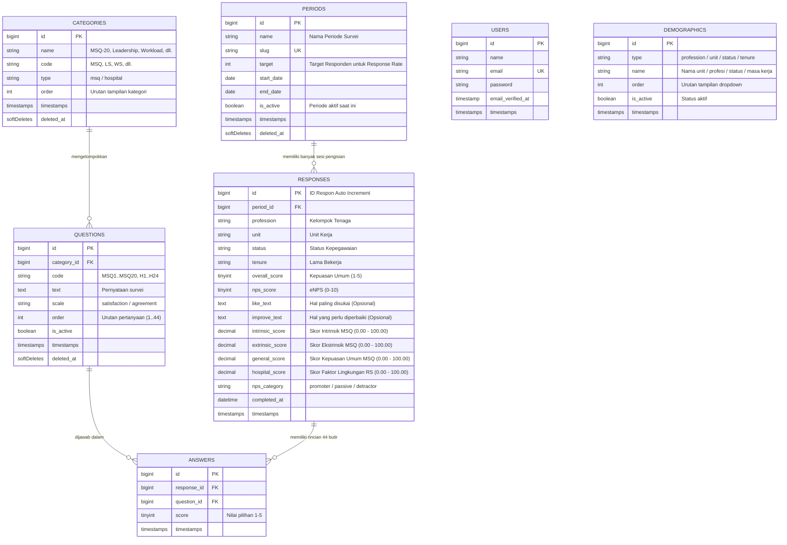

# HESS — Entity Relationship Diagram (ERD)

> Version: 1.0  
> Target: Laravel 13 Database Schema  
> Arsitektur: Skema Simpel & Terkonsolidasi (6 Tabel Inti)

---

## 1. Konsep & Filosofi Desain

Skema basis data HESS dirancang dengan prinsip **simpel, cepat untuk query agregasi analitik, dan menjamin anonimitas responden**.

Data pengisian yang memiliki relasi **1-to-1** (profil demografi responden, masukan teks terbuka, dan skor kalkulasi akhir) dikonsolidasikan langsung ke dalam tabel `responses`. Hal ini mengeliminasi kebutuhan `JOIN` multi-tabel yang berat saat Admin membuka dashboard atau mengekspor laporan ke Excel.

---

## 2. Diagram Relasi (Mermaid ERD)



---

## 3. Kamus Data & Spesifikasi Tabel

### 3.1. `users`
Menyimpan akun login Admin rumah sakit. Role dan izin dikelola via *Spatie Laravel Permission*.

| Kolom | Tipe Data | Atribut | Keterangan |
| :--- | :--- | :--- | :--- |
| `id` | BIGINT UNSIGNED | PK, Auto Increment | Identifikasi unik admin |
| `name` | VARCHAR(255) | NOT NULL | Nama admin |
| `email` | VARCHAR(255) | NOT NULL, UNIQUE | Email login |
| `password` | VARCHAR(255) | NOT NULL | Hash bcrypt/argon2 |
| `email_verified_at`| TIMESTAMP | NULLABLE | Verifikasi email |
| `remember_token` | VARCHAR(100) | NULLABLE | Remember me session |
| `timestamps` | TIMESTAMP | NOT NULL | `created_at` & `updated_at` |

---

### 3.2. `periods`
Menyimpan siklus periode pelaksanaan survei kepuasan pegawai.

| Kolom | Tipe Data | Atribut | Keterangan |
| :--- | :--- | :--- | :--- |
| `id` | BIGINT UNSIGNED | PK, Auto Increment | Identifikasi unik periode |
| `name` | VARCHAR(255) | NOT NULL | Misal: *"Survei Kepuasan Q1 2026"* |
| `slug` | VARCHAR(255) | NOT NULL, UNIQUE | URL slug untuk akses survei |
| `target` | INT UNSIGNED | DEFAULT 0 | Target jumlah pegawai (untuk Response Rate) |
| `start_date` | DATE | NOT NULL | Tanggal mulai survei |
| `end_date` | DATE | NOT NULL | Tanggal akhir survei |
| `is_active` | BOOLEAN | DEFAULT FALSE | Flag penentu periode aktif saat ini |
| `timestamps` | TIMESTAMP | NOT NULL | `created_at` & `updated_at` |
| `deleted_at` | TIMESTAMP | NULLABLE | Soft delete |

---

### 3.3. `categories`
Menyimpan kelompok instrumen soal kuesioner.

| Kolom | Tipe Data | Atribut | Keterangan |
| :--- | :--- | :--- | :--- |
| `id` | BIGINT UNSIGNED | PK, Auto Increment | ID kategori |
| `name` | VARCHAR(255) | NOT NULL | Misal: *"MSQ-20"*, *"Leadership & Supervision"* |
| `code` | VARCHAR(50) | NOT NULL | Kode pengenal singkat: `MSQ`, `LS`, `WS`, dll. |
| `type` | VARCHAR(20) | NOT NULL | Nilai: `msq` atau `hospital` |
| `order` | INT | DEFAULT 0 | Urutan pengelompokan |
| `timestamps` | TIMESTAMP | NOT NULL | `created_at` & `updated_at` |
| `deleted_at` | TIMESTAMP | NULLABLE | Soft delete |

---

### 3.4. `questions`
Menyimpan 44 butir pertanyaan baku instrumen HESS.

| Kolom | Tipe Data | Atribut | Keterangan |
| :--- | :--- | :--- | :--- |
| `id` | BIGINT UNSIGNED | PK, Auto Increment | ID pertanyaan |
| `category_id` | BIGINT UNSIGNED | FK -> `categories.id` | Kategori induk pertanyaan |
| `code` | VARCHAR(20) | NOT NULL | Kode item: `MSQ1`..`MSQ20`, `H1`..`H24` |
| `text` | TEXT | NOT NULL | Bunyi butir pernyataan |
| `scale` | VARCHAR(20) | NOT NULL | Nilai: `satisfaction` (Puas) / `agreement` (Setuju) |
| `order` | INT | DEFAULT 0 | Urutan tampil dalam survei (1–44) |
| `is_active` | BOOLEAN | DEFAULT TRUE | Status aktif pertanyaan |
| `timestamps` | TIMESTAMP | NOT NULL | `created_at` & `updated_at` |
| `deleted_at` | TIMESTAMP | NULLABLE | Soft delete |

---

### 3.5. `responses`
Tabel transaksi utama untuk **satu sesi pengisian kuesioner oleh responden anonim**. Mengonsolidasikan profil, masukan terbuka, dan skor terhitung.

| Kolom | Tipe Data | Atribut | Keterangan |
| :--- | :--- | :--- | :--- |
| `id` | BIGINT UNSIGNED | PK, Auto Increment | ID unik respon |
| `period_id` | BIGINT UNSIGNED | FK -> `periods.id` | Periode survei yang diikuti |
| **Profil Demografi** | | | |
| `profession` | VARCHAR(100) | NOT NULL | Kelompok tenaga (Dokter, Perawat, dll.) |
| `unit` | VARCHAR(100) | NOT NULL | Unit kerja (IGD, ICU, Rawat Inap, dll.) |
| `status` | VARCHAR(50) | NOT NULL | Status kepegawaian (Tetap, Kontrak, dll.) |
| `tenure` | VARCHAR(50) | NOT NULL | Lama bekerja (< 1 th, 1-3 th, dll.) |
| **Penilaian Keseluruhan** | | | |
| `overall_score` | TINYINT UNSIGNED| NOT NULL | Penilaian kepuasan global (skala 1–5) |
| `nps_score` | TINYINT UNSIGNED| NOT NULL | Nilai eNPS rekomendasi tempat kerja (0–10) |
| `like_text` | TEXT | NULLABLE | Masukan: hal yang paling disukai |
| `improve_text` | TEXT | NULLABLE | Masukan: hal yang perlu diperbaiki |
| **Skor Analitik (Auto)** | | | |
| `intrinsic_score`| DECIMAL(5,2) | NOT NULL, DEFAULT 0 | Persentase skor 12 item intrinsik MSQ |
| `extrinsic_score`| DECIMAL(5,2) | NOT NULL, DEFAULT 0 | Persentase skor 6 item ekstrinsik MSQ |
| `general_score` | DECIMAL(5,2) | NOT NULL, DEFAULT 0 | Persentase skor 20 item umum MSQ |
| `hospital_score` | DECIMAL(5,2) | NOT NULL, DEFAULT 0 | Persentase skor 24 item faktor RS |
| `nps_category` | VARCHAR(20) | NOT NULL | `promoter` (9-10), `passive` (7-8), `detractor` (0-6) |
| `completed_at` | DATETIME | NOT NULL | Waktu submit survei |
| `timestamps` | TIMESTAMP | NOT NULL | `created_at` & `updated_at` |

> **Indeks Optimasi untuk Dashboard:**  
> `INDEX (period_id, unit)`  
> `INDEX (period_id, profession)`  
> `INDEX (period_id, nps_category)`

---

### 3.6. `answers`
Menyimpan rincian pilihan angka (skala Likert 1–5) untuk setiap butir pertanyaan yang dijawab responden (44 baris per respon).

| Kolom | Tipe Data | Atribut | Keterangan |
| :--- | :--- | :--- | :--- |
| `id` | BIGINT UNSIGNED | PK, Auto Increment | ID jawaban |
| `response_id` | BIGINT UNSIGNED | FK -> `responses.id` | ID respon kuesioner (Cascade On Delete) |
| `question_id` | BIGINT UNSIGNED | FK -> `questions.id` | ID pertanyaan yang dijawab |
| `score` | TINYINT UNSIGNED| NOT NULL | Pilihan jawaban (1, 2, 3, 4, atau 5) |
| `timestamps` | TIMESTAMP | NOT NULL | `created_at` & `updated_at` |

> **Constraint Integritas:**  
> `UNIQUE (response_id, question_id)` ➔ Mencegah responden menjawab pertanyaan yang sama lebih dari satu kali.

---

## 4. Relasi Model Eloquent Laravel

```php
// App\Models\Period
public function responses(): HasMany
{
    return $this->hasMany(Response::class);
}

// App\Models\Category
public function questions(): HasMany
{
    return $this->hasMany(Question::class)->orderBy('order');
}

// App\Models\Question
public function category(): BelongsTo
{
    return $this->belongsTo(Category::class);
}

public function answers(): HasMany
{
    return $this->hasMany(Answer::class);
}

// App\Models\Response
public function period(): BelongsTo
{
    return $this->belongsTo(Period::class);
}

public function answers(): HasMany
{
    return $this->hasMany(Answer::class);
}

// App\Models\Answer
public function response(): BelongsTo
{
    return $this->belongsTo(Response::class);
}

public function question(): BelongsTo
{
    return $this->belongsTo(Question::class);
}
```

---

## 5. Keuntungan Struktur Ini untuk Dashboard & Laporan

1. **Dashboard KPI Super Cepat**:
   ```php
   // Total responden & rata-rata kepuasan periode aktif:
   $totalResponden = Response::where('period_id', $activePeriodId)->count();
   $avgGeneral     = Response::where('period_id', $activePeriodId)->avg('general_score');
   $avgIntrinsic   = Response::where('period_id', $activePeriodId)->avg('intrinsic_score');
   $avgExtrinsic   = Response::where('period_id', $activePeriodId)->avg('extrinsic_score');
   $avgHospital    = Response::where('period_id', $activePeriodId)->avg('hospital_score');
   ```
2. **Kalkulasi eNPS Tanpa Join**:
   ```php
   $promoters  = Response::where('period_id', $activePeriodId)->where('nps_category', 'promoter')->count();
   $detractors = Response::where('period_id', $activePeriodId)->where('nps_category', 'detractor')->count();
   $npsScore   = $totalResponden > 0 ? round((($promoters - $detractors) / $totalResponden) * 100) : 0;
   ```
3. **Analisis Berdasarkan Unit Kerja**:
   ```php
   $perUnit = Response::where('period_id', $activePeriodId)
       ->select('unit', DB::raw('COUNT(*) as total'), DB::raw('AVG(general_score) as avg_score'))
       ->groupBy('unit')
       ->get();
   ```
4. **Ekspor Data Excel Mudah**:
   Admin dapat langsung mengekspor tabel `responses` lengkap dengan profil pegawai, masukan kualitatif, serta skor akhir per responden tanpa query join kompleks.
