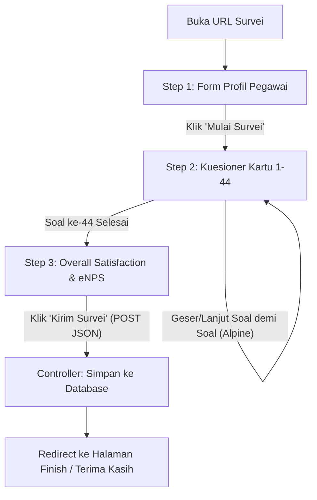

# HESS — Frontend Architecture & Development Guide

> Version: 1.0  
> Stack: Laravel 13 + Blade + Alpine.js + Tailwind CSS v4 + Vite  
> Target: Antarmuka Modern, Bersih, Mobile-First, dan Zero-Latency

---

## 1. Filosofi & Standar Kode Frontend

Agar kode tidak menjadi *"spaghetti"* atau bercampur aduk antara HTML, CSS kustom, dan ratusan baris JavaScript di satu file, ikuti prinsip dasar berikut:

1. **Pemisahan Peran (Separation of Concerns)**:
   - **Blade**: Bertanggung jawab penuh atas struktur HTML semantik dan rendering data server awal.
   - **Alpine.js**: Bertanggung jawab atas reaktivitas UI lokal di browser (state kuesioner, transisi kartu soal, autosave, progress bar).
   - **Tailwind CSS v4**: Bertanggung jawab atas seluruh styling menggunakan utility-first class dan custom design tokens. Hindari tag `<style>` inline.
   - **File JS Eksternal**: Logika state kuesioner dipisahkan ke file `resources/js/survey-wizard.js` (tidak ditumpuk di dalam tag `<script>` file Blade).
2. **Mobile-First & Sentuhan Ramah (Thumb-Friendly)**:
   - Sebagian besar pegawai rumah sakit mengisi kuesioner melalui ponsel pintar saat istirahat kerja.
   - Tombol navigasi (*Lanjut / Kembali*) berada di bagian bawah layar (*fixed bottom navigation*) yang mudah dijangkau satu tangan.
   - Ukuran elemen klik minimal berdimensi **48x48px** agar mudah disentuh.
3. **Zero Network Latency**:
   - Seluruh 44 soal di-*render* sekaligus oleh Blade dalam struktur JSON/HTML awal.
   - Perpindahan soal 1 s/d 44 ditangani instan oleh Alpine.js tanpa request server per butir soal.

---

## 2. Struktur Direktori Frontend yang Rapi

Susun file di bawah `resources/` dengan struktur terorganisir berikut:

```text
resources/
├── css/
│   └── app.css                   <-- Konfigurasi Tailwind v4 & Design Tokens (@theme)
├── js/
│   ├── app.js                    <-- Entry point Vite (registrasi Alpine.js & plugin)
│   ├── survey-wizard.js          <-- Logika State Kuesioner Responden (Alpine Component)
│   └── admin-charts.js           <-- Inisialisasi Chart.js untuk Dashboard Admin
└── views/
    ├── layouts/
    │   ├── survey.blade.php      <-- Layout minimalis khusus kuesioner responden
    │   └── admin.blade.php       <-- Layout admin (Sidebar, Navbar, Content Area)
    ├── components/
    │   ├── button.blade.php      <-- Komponen tombol konsisten
    │   ├── card.blade.php        <-- Komponen kartu kontainer
    │   ├── progress-bar.blade.php<-- Progress bar animasi kuesioner
    │   ├── choice-item.blade.php <-- Opsi pilihan skala 1-5 (radio card)
    │   └── kpi-card.blade.php    <-- Kartu metrik KPI di dashboard
    ├── survey/
    │   ├── index.blade.php       <-- Halaman utama kuesioner (memuat wizard)
    │   ├── finish.blade.php      <-- Halaman konfirmasi terima kasih
    │   └── partials/
    │       ├── header.blade.php  <-- Header brand HESS
    │       ├── profile.blade.php <-- Step 1: Form demografi pegawai
    │       ├── question.blade.php<-- Step 2: Kartu pertanyaan kuesioner
    │       └── overall.blade.php <-- Step 3: Overall satisfaction & eNPS
    └── admin/
        ├── auth/
        │   └── login.blade.php   <-- Halaman login admin
        ├── dashboard.blade.php   <-- Dashboard utama (KPI, Charts, Feedback)
        ├── periods/              <-- CRUD Periode survei
        └── questions/            <-- CRUD Master 44 butir pertanyaan
```

---

## 3. Design System & Tokens (Tailwind CSS v4)

Warna identitas HESS mengadopsi tema rumah sakit profesional bernuansa ungu elegan (*Royal Plum*), bersih, dan ramah mata.

Konfigurasikan di `resources/css/app.css`:

```css
@import 'tailwindcss';

@source '../../vendor/laravel/framework/src/Illuminate/Pagination/resources/views/*.blade.php';
@source '../../storage/framework/views/*.php';
@source '../views/**/*.blade.php';

@theme {
    /* Font Family */
    --font-sans: 'Inter', ui-sans-serif, system-ui, -apple-system, sans-serif;

    /* Palette Warna HESS */
    --color-primary-50: #faf5fc;
    --color-primary-100: #f4e9f7;
    --color-primary-200: #e9d4ef;
    --color-primary-300: #d6b3e1;
    --color-primary-500: #8d5b9b;
    --color-primary-600: #6f3f7e;   /* Warna Utama Brand */
    --color-primary-700: #5b3267;
    --color-primary-900: #3c1e45;

    --color-surface: #f7f4f8;       /* Background Halaman */
    --color-card: #ffffff;          /* Background Kartu */
    --color-text-main: #263238;     /* Teks Utama */
    --color-text-muted: #6b7280;    /* Teks Keterangan */
}
```

---

## 4. Arsitektur State Kuesioner (`survey-wizard.js`)

Alih-alih menaruh logika JavaScript di Blade, buat modul terpisah di `resources/js/survey-wizard.js` yang didaftarkan ke Alpine.js:

```javascript
export default (questionsData, submitUrl, csrfToken) => ({
    // State Navigasi
    step: 'profile', // 'profile' | 'questionnaire' | 'overall'
    currentIndex: 0,
    questions: questionsData,
    
    // State Data Pengisian
    profile: {
        profession: '',
        unit: '',
        status: '',
        tenure: ''
    },
    answers: {},
    overall: {
        overall_score: null,
        nps_score: null,
        like_text: '',
        improve_text: ''
    },

    // Inisialisasi & Restore LocalStorage
    init() {
        const saved = localStorage.getItem('hess_survey_draft');
        if (saved) {
            try {
                const parsed = JSON.parse(saved);
                this.profile = parsed.profile || this.profile;
                this.answers = parsed.answers || {};
                this.overall = parsed.overall || this.overall;
            } catch (e) {
                console.warn('Gagal memulihkan draft', e);
            }
        }
        this.$watch('answers', () => this.persistDraft());
        this.$watch('profile', () => this.persistDraft());
    },

    persistDraft() {
        localStorage.setItem('hess_survey_draft', JSON.stringify({
            profile: this.profile,
            answers: this.answers,
            overall: this.overall
        }));
    },

    // Navigasi
    startSurvey() {
        if (!this.profile.profession || !this.profile.unit || !this.profile.status || !this.profile.tenure) {
            alert('Silakan lengkapi seluruh profil terlebih dahulu.');
            return;
        }
        this.step = 'questionnaire';
        window.scrollTo({ top: 0, behavior: 'smooth' });
    },

    nextQuestion() {
        const currentQ = this.questions[this.currentIndex];
        if (!this.answers[currentQ.id]) return;

        if (this.currentIndex < this.questions.length - 1) {
            this.currentIndex++;
            window.scrollTo({ top: 0, behavior: 'smooth' });
        } else {
            this.step = 'overall';
            window.scrollTo({ top: 0, behavior: 'smooth' });
        }
    },

    prevQuestion() {
        if (this.currentIndex > 0) {
            this.currentIndex--;
            window.scrollTo({ top: 0, behavior: 'smooth' });
        } else {
            this.step = 'profile';
        }
    },

    // Progress Bar (0 - 100%)
    get progressPercentage() {
        if (this.step === 'profile') return 5;
        if (this.step === 'overall') return 95;
        return Math.round(((this.currentIndex + 1) / this.questions.length) * 90) + 5;
    },

    // Submit ke Server
    async submitSurvey() {
        const payload = {
            _token: csrfToken,
            profile: this.profile,
            answers: this.answers,
            overall: this.overall
        };

        const res = await fetch(submitUrl, {
            method: 'POST',
            headers: { 'Content-Type': 'application/json', 'Accept': 'application/json' },
            body: JSON.stringify(payload)
        });

        if (res.ok) {
            localStorage.removeItem('hess_survey_draft');
            window.location.href = '/survey/finish';
        } else {
            alert('Terjadi kesalahan saat menyimpan survei. Silakan coba lagi.');
        }
    }
});
```

---

## 5. Yang Perlu Disiapkan di Awal (Setup Checklist)

Agar proses coding berjalan cepat, rapi, dan minim refactoring di tengah jalan, siapkan hal-hal berikut terlebih dahulu:

### 1. Install Alpine.js via NPM
Jalankan di terminal:
```bash
npm install alpinejs
```

Di `resources/js/app.js`, daftarkan Alpine.js dan komponen wizard:
```javascript
import Alpine from 'alpinejs';
import surveyWizard from './survey-wizard';

window.Alpine = Alpine;
Alpine.data('surveyWizard', surveyWizard);
Alpine.start();
```

### 2. Pasang Chart Library untuk Dashboard Admin
Install Chart.js untuk merender grafik kepuasan di dashboard:
```bash
npm install chart.js
```

### 3. Buat Layout Master Blade
1. **`resources/views/layouts/survey.blade.php`**: Layout bersih bebas gangguan navigasi luar, mobile-optimized, memuat `@vite(['resources/css/app.css', 'resources/js/app.js'])`.
2. **`resources/views/layouts/admin.blade.php`**: Layout standar dasbor dengan sidebar kiri responsif dan header admin.

### 4. Pisahkan Komponen Blade (Atomic Components)
Buat komponen yang sering dipakai ulang:
- `<x-card>`: Wrapper kartu putih bersudut lengkung (`rounded-2xl border border-gray-100 shadow-sm`).
- `<x-button>`: Tombol dengan varian `primary`, `secondary`, dan ukuran konsisten.

---

## 6. Alur Halaman Kuesioner (Zero Page Reload)



Dokumen ini menjadi acuan utama tim pengembang agar kode antarmuka kuesioner dan dasbor admin tetap konsisten, bersih, dan mudah dirawat.
